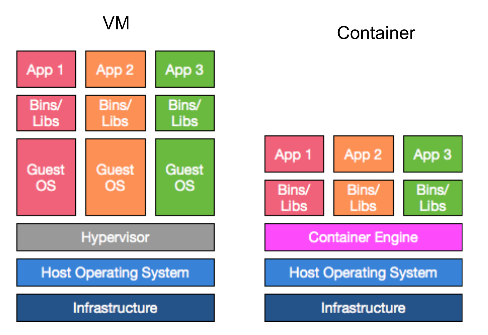
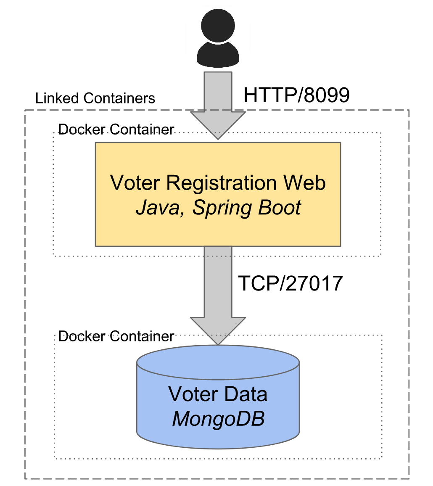

title: Introdução a Docker
class: animation-fade
layout: true

<!-- This slide will serve as the base layout for all your slides -->
.bottom-bar[
  {{title}}
]

---

class: impact

# {{title}}
## With a good subtitle :-)

---

# O que é um contêiner?

* Permite você definir e empacotar um ambiente de execução dentro de uma imagem executável.

* Essa image pode conter:
  * Binários de uma aplicação
  * Configurações para uma aplicação
  * Todas as suas dependências
  * Configurações de sistema (arquivos, diretórios, variáveis de ambiente, etc.)

---

# O que é um contêiner?

* Utiliza o sistema operacional para **isolar** o processo, rede e sistema de arquivo do contêiner para que aparente que seja um ambiente de servidor auto-contido

* contêiners devem ser pensados como sendo **imutáveis**
 * Alterações na configuracão do contêiner deve ser manejado com redefinição e reconstrução da imagem do contêiner

---

# Por que nós usaríamos contêiner?

* Maior previsibilidade do estado do ambiente
* Simplificar o processo de mover software entre diferentes ambientes e configurações
* Criar rapidamente ambientes de desenvolvimento
* Evitar _dependency hell_ (ex: múltiplas versões de Java/Ruby)
* Útil para microserviços -- contêiners são menores e mais leves que VMs

---

# Qual é a diferença entre um contêiner e uma VM?

* VMs rodam seu próprio e completo sistema operacional
* Contêiners compartilham o Kernel do sistema operacional do Host
* Contêiners podem inicializar muito mais rápido
* As imagens dos contêiners podem ser muito menores
* Contêiners consumem menos recursos do sistema que uma VM

---

# Qual é a diferença entre um contêiner e uma VM?

.center[]

---

class: impact

# O Objetivo

---

# Registro de Votos

* Desenvolvido por Gary Stafford para ajudar a recrutar engenheiros de infraestrutura.
* Uma simples aplicação Java Spring Boot com Mongo DB
* Vamos fazer a execução local do projeto

---

# A Arquitetura da Aplicação

.center[]

---

# A Arquitetura da Aplicação

.center[]

---

class: impact

# Ao trabalho...

---

# Verifique se Docker está funcionando na sua máquina 

```shell
docker run hello-world
```

---

# Docker run

* O comando `docker run` inicializa um contêiner a partir de uma imagem existente (seja ela local ou de um repositório de Docker)

Utilização:
```shell
docker run [OPÇÕES] IMAGEM [COMANDOS] [ARGUMENTOS...]
```

---

# Executar MongoDB em um contêiner

### Documentação

https://hub.docker.com/_/mongo

https://github.com/docker-library/mongo/blob/4a81205a13fefc418355248f750551e4f7c62361/3.0/Dockerfile

### Execução

```shell
docker run -d -p 27017:27017 mongo
docker ps
```

---

# Docker run

```shell
docker run -d -p 27017:27017 mongo
```

**-d, --detach**  Executa um contêiner em *background* e imprime o ID do contêiner.

**-p, --publish *hostPort:containerPort*** Publica a(s) porta(s) do contêiner na máquina hospedeira.

---

# Docker ps

* O comando `docker ps` lista todos os contêiners do hospedeiro.

Utilização:
```shell
docker ps
```

---

# Uma nota sobre dockerizar banco de dados

* Tenha bastante cuidado em dockerizar banco de dados
* Docker é normalmente utilizado para aplicações sem estado
* Quando um contêiner para, quaisquer dados armazenados nele são perdidos
* Volumes podem ser montados junto ao Docker para persistir dados

---

# Criando o artefato

* Clone o repositório do sistema de votação
* Execute localmente o artefato (Note que os testes falharão se não houver um MongoDB sendo executado)

```shell
$ git clone --depth 1 --branch master \
  https://github.com/ThoughtWorksInc/voter-service.git

$ cd voter-service

$ ./gradlew clean build -x test

$ java -jar build/libs/voter-service-0.2.0.jar
```

Teste em: http://localhost:8099/candidates

---

# Criando o artefato dentro do Docker

```Dockerfile
FROM openjdk:8u181-jdk
COPY ./voter-service ./usr/local/voter-service
WORKDIR /usr/local/voter-service
RUN ./gradlew clean build -x test
EXPOSE 8099
CMD ["java", "-jar", "build/libs/voter-service-0.2.0.jar", "--spring.data.mongodb.host=voter-mongo"]
```

```shell
docker build -t voter-registration/web .
```

---

# Dockerfile

O Dockerfile diz para o Docker como criar (e executar) a imagem do seu contêiner.

Palavras-chaves utilizadas:

**FROM** - especifica a imagem base do contêiner  
**RUN** - executa um comando como parte da construção do contêiner  
**COPY** - copia arquivos para dentro do contêiner  
**ENV** - configura uma variável de ambiente  
**EXPOSE** -  documenta uma porta particular para ser exposta pelo contêiner  
**CMD** - específica um comando que será executado quando o `docker run` for realizado  
**WORKDIR** - muda para o diretório informado (igual ao comando `cd`). Se o diretório não existir, ele é criado.

---

# Docker build

O comando `docker build` constrói uma imagem desde um Dockerfile e um contexto. O contexto da construção é o conjunto de arquivos em um PATH ou URL de local especificado. O PATH é um diretório em seu sistema de arquivos local. O URL é um local do repositório Git.

Utilização:
```shell
docker build [OPÇÕES] PATH | URL | -
```

**-t, --tag *nome:tag***  Nome e opcionalmente uma tag

---

# Docker kill

Mata um ou mais contêiners que estejam sendo executados

Utilização:
```shell
docker kill CONTAINER ID | NOME
```

* Mate o contêiner do mongo
```shell
docker ps
docker kill CONTAINER ID
```

---

# Docker ps

```shell
docker ps -a
```

**-a, --all** lista todos containers (Por default, somente mostra os que estão executando)

---

# Docker rm

* Remove um ou mais contêiners

```shell
docker rm CONTAINER ID | NOME
```

---

# Docker run

```shell
docker run --rm -d --name voter-mongo mongo
```
**--rm** Automaticamente remove o contêiner quanto sair.

**-d, --detach**  Executa um contêiner em *background* e imprime o ID do contêiner.

**-p, --publish *hostPort:containerPort*** Publica a(s) porta(s) do contêiner na máquina hospedeira.

**--name** Atribui um nome custom para o contêiner (default gera um random)

---

# Docker run: conectando as coisas

```shell
docker run --rm -p 8099:8099 --name voter-registration-web --link voter-mongo:mongo voter-registration/web
```

**--rm** Automaticamente remove o contêiner quanto sair.

**-p, --publish *hostPort:containerPort*** Publica a(s) porta(s) do contêiner na máquina hospedeira.

**--name** Atribui um nome custom para o contêiner (default gera um random)

**--link _list_(nome:alias)**  Adiciona uma conexão com outros contêiners

Teste em: http://localhost:8099/candidates

---

# Limpando imagem

Listar todas as imagens locais

```shell
docker images
```

Excluir uma imagem
```shell
docker rmi NOMEDAIMAGEM
```
